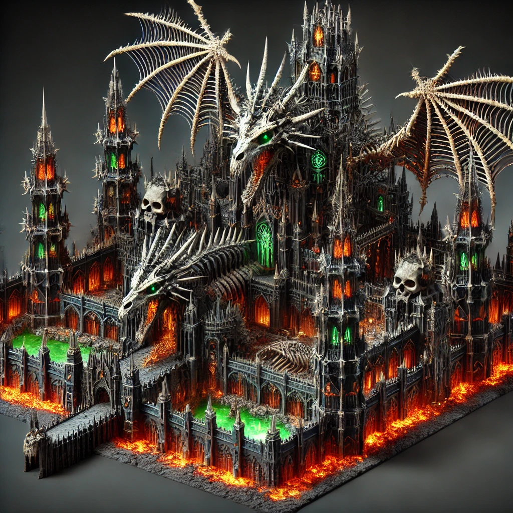
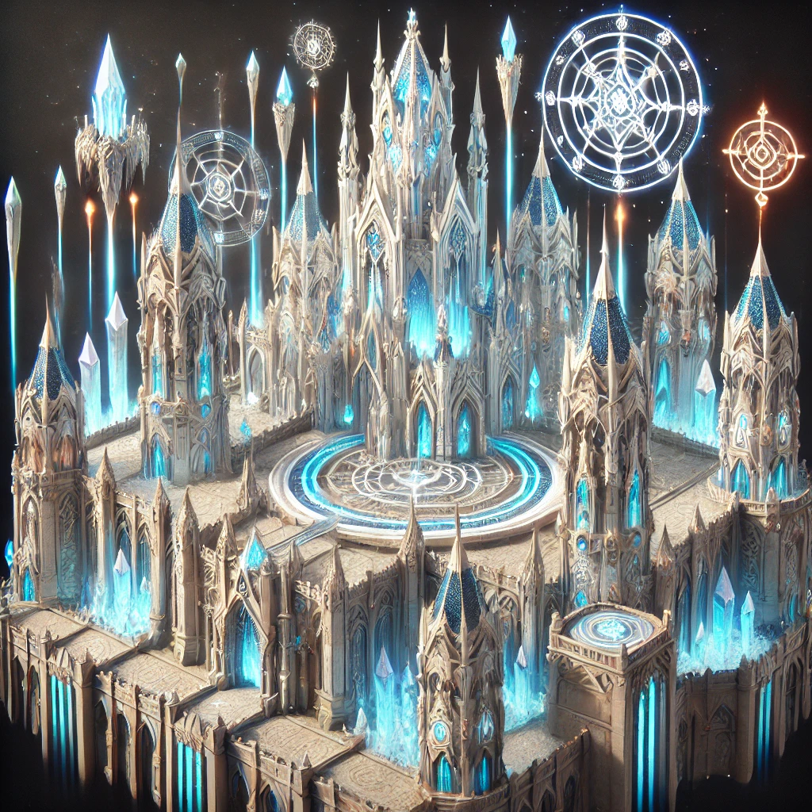

# System fortec

## Czym są fortece?

Fortece to mniejsze, strategicznie rozmieszczone obiekty w naszym świecie, które pełnią kluczową rolę w ochronie i wspieraniu granicznych terenów. Ich głównym zadaniem jest wspomaganie lokalnych społeczności, takich jak rolnicy, rzemieślnicy czy pracownicy, zapewniając im bezpieczeństwo i stabilność.

W świecie naszej gry fortece są sercem lokalnej obrony i wsparcia. Walczą z nacierającymi bestiami, odpierają wrogów i zabezpieczają wejścia do niebezpiecznych lochów (dungeonów). Są także punktem centralnym dla działań obronnych danej rasy lub społeczności, wzmacniając jej obecność na trudnych terenach.

Fortece to nie tylko miejsca walki, ale też schronienie i ośrodki wsparcia, które odgrywają istotną rolę w życiu mieszkańców tego świata.

## Dane technicznie Fortec

1. Fortyfikacje zewnętrzne

   - **Mury obronne**:
       - Niższe i cieńsze niż w zamkach, ale wciąż solidne, z kilkoma strzelnicami dla łuczników.
       - Rozmieszczone co 50 metrów wieże strażnicze wyposażone w proste machiny oblężnicze (np. balisty).
   - **Fosa lub barykady**:
       - Opcjonalnie otaczające fortecę, szczególnie w regionach narażonych na częste ataki.
       - Często zastępowane przez naturalne przeszkody, jak lasy czy strome wzgórza.
   - **Główna brama**:
       - Pojedyncza, zabezpieczona kratownicą, z miejscem na zwodzony most w bardziej rozbudowanych fortecach.

2. Obszar wewnętrzny:

   - **Plac centralny**:
       - Serce fortecy, pełniące funkcję placu zebrań, miejsca załadunku zapasów i formowania oddziałów.
   - **Główne budynki**:
       - **Kwatera dowódcy**: Siedziba zarządcy fortecy i miejsce przechowywania strategicznych map.
       - **Skład zapasów**: Magazyny na żywność, wodę i broń.
       - **Koszary**: Proste pomieszczenia dla garstki żołnierzy (20-50 osób).
       - **Kuźnia**: Do naprawy broni i pancerzy.
       - **Szpitalik**: Podstawowe miejsce opatrunkowe dla rannych.

3. Funkcje i mechanizmy:

   - **Wsparcie społeczności**:
       - Ochrona pobliskich wiosek przed atakami potworów i bandytów.
       - Organizacja patroli i konwojów dla rolników i rzemieślników.
   - **Obrona terytorium**:
       - Kluczowy punkt kontrolny dla regionu, pozwalający monitorować ruchy wroga.
       - Utrudnia wrogom dostęp do większych zamków w głębi lądu.
   - **Schronienie**:
       - Miejsce, gdzie mieszkańcy mogą się ukryć podczas większego zagrożenia.

4. Dodatki:

   - **Posterunki obserwacyjne**:
       - Małe wieżyczki lub punkty obserwacyjne na granicy fortecy.
   - **Tajemne przejścia**:
       - Ukryte drogi ewakuacji dla dowódcy i kluczowych zapasów.
   - **Pułapki obronne**:
       - Wilcze doły i zapadnie rozmieszczone w pobliżu fortecy.

## Szczegółowy opis fortecy

1. Mury i Obrona Zewnętrzna

   - **Mury Zewnętrzne**:
       - Wysokość: 6-8 metrów, grubość: 1,5 metra, zbudowane z kamienia lub drewna, zależnie od dostępności materiałów w regionie.
       - **Elementy obronne**:
           - **Strzelnice**: Rozmieszczone równomiernie, dostosowane do użycia łuków i kusz.
           - **Krenelaż**: Zębate zwieńczenia murów zapewniające ochronę obrońcom podczas walki.
           - **Machikuły**: Proste galerie do rzucania kamieni, wylewania gorącej cieczy lub rażenia wrogów z góry.
   - **Wieże Obronne**:
       - Rozstawione co 30-40 metrów dla optymalnej obrony.
       - Konstrukcja: Kwadratowe lub prostokątne, z trzema poziomami:
           - **Dolny poziom**: Magazyn i miejsce schronienia.
           - **Środkowy poziom**: Stanowiska dla łuczników i kuszników.
           - **Górny poziom**: Wyposażony w proste machiny oblężnicze, np. balisty.
   - **Brama Główna**:
       - Wąska, solidna konstrukcja (3-4 metry szerokości).
       - **Zabezpieczenia**:
           - Kratownica (portcullis).
           - Drewniane wrota wzmocnione metalem.
           - Otwory mordercze nad bramą umożliwiające rażenie atakujących.
       - Most zwodzony nad fosą lub stała rampa w zależności od terenu.
   - **Fosa**:
       - Szerokość: 5-7 metrów, głębokość: 2-3 metry.
       - Wypełniona wodą lub sucha, często wzmocniona ostrymi kolcami na dnie (chevaux-de-fraise).

2. Dolna Część Fortecy (Dziedziniec)

   - **Plac Centralny**:
       - Otwarta przestrzeń służąca do formowania oddziałów, przechowywania zapasów i organizacji obrony.
   - **Kluczowe Budynki**:
       - **Zbrojownia**: Magazyn na broń i amunicję dla żołnierzy.
       - **Koszary**:
           - Przeznaczone dla 20-25 żołnierzy.
           - Wyposażone w łóżka, stojaki na broń i piec do ogrzewania.
       - **Kuźnia i Warsztat**:
           - Miejsce napraw i produkcji broni oraz tarcz.
       - **Spiżarnia**:
           - Zapasy żywności na około 2-3 miesiące.
           - Zabezpieczona przed szkodnikami i wilgocią.
       - **Wieża Sygnalizacyjna**:
           - Najwyższy punkt fortecy, wyposażony w system alarmowy (dzwony, flagi, ogniska).

3. Górna Część Fortecy

   - **Główna Siedziba Dowódcy**:
       - Parter: Sala narad z mapami strategicznymi i stołem.
       - Piętro: Kwatera dowódcy z miejscem na odpoczynek i przechowywanie dokumentów.
   - **Szpitalik**:
       - Pomieszczenie medyczne z podstawowym wyposażeniem (łóżka, zioła, bandaże).
   - **Magazyn Zapasów Taktycznych**:
       - Przechowuje kamienie, smołę, drewno i inne materiały do obrony.

4. Fortyfikacje Wewnętrzne

   - **Mury Wewnętrzne**:
       - Dodatkowa linia obrony otaczająca kluczowe budynki w fortecy.
       - Wyposażone w krenelaż i strzelnice dla obrońców.
   - **Brama Wewnętrzna**:
       - Prosta, lecz solidna konstrukcja, prowadząca do górnej części fortecy.

5. Kluczowe Cele w PvP

   - **Wieża Główna (Bastion)**:
       - Centralny punkt fortecy, w którym znajduje się flaga klanu.
       - **Funkcje**:
           - Sala główna jako przestrzeń do zatknięcia flagi.
           - Platforma na szczycie do obrony końcowej.
   - **Kwatera Generałów**:
       - Cztery strategiczne punkty, gdzie przebywają generałowie NPC.
       - Każdy generał ma klucz do sali głównej.
   - **Przejścia Taktyczne**:
       - Tunel ewakuacyjny dla obrońców.
       - Ukryte korytarze umożliwiające szybkie przemieszczanie się w obrębie fortecy.

6. Jednostki i Obrona

   - **Strażnicy i Łucznicy**:
       - Rozmieszczeni na murach, w wieżach i przy bramie głównej.
   - **Inżynierowie**:
       - Obsługują balisty i naprawiają uszkodzone mury.
   - **Zwiadowcy**:
       - Patrolują teren wokół fortecy i ostrzegają o zbliżającym się wrogu.

7. Elementy Dodatkowe

   - **System Alarmowy**:
       - Dzwony, flagi i ogniska sygnalizacyjne umożliwiające szybkie zwołanie obrońców.
   - **System Pułapek**:
       - Wilcze doły, zapadnie i barykady rozmieszczone wokół murów.
   - **Rezerwowy Magazyn**:
       - Podziemny schron z zapasami żywności i amunicji na wypadek długiego oblężenia.
   - **Kanalizacja**:
       - System odprowadzający ścieki poza fortecę, zabezpieczony przed infiltracją wroga.

## Propozycje graficzne

### Forteca Hali Herosów

### Forteca Sokole Oko

### Forteca Sokolej Chwały

### Forteca Jastrzębiej Odwagi

### Forteca Leśnego Króla

### Forteca Leśnych Elfów

### Forteca Tytanicznego Golema

### Forteca Ognistej Salamandry

### Forteca Parszywych Nekromantów

### Forteca Nieumarłych Smoków

### Forteca Władcy Lodu

### Forteca Lodowych Bestii

### Forteca Czarnoksiężników

### Forteca Magicznej Mocy

### Forteca Papieża

### Forteca Władcy Paladynów

### Forteca Białych Trolli

### Forteca Czarnych Trolli

### Forteca Gigantów

### Forteca Władcy Ogrów

### Forteca Władcy Jaszczuroludzi

### Forteca Monstrualnego Dinozaura

### Forteca Olbrzymiego Krokodyla

### Forteca Czerwonych Orków

### Forteca Zielonych Orków

### Forteca Zielonych Goblinów

### Forteca Czarnych Orków

### Forteca Czarnych Goblinów

### Forteca Ogromnego Wieloryba

### Forteca Syren

### Forteca Nagi

### Forteca Ciemnoskórej Hydry

### Forteca Monstrualnego Bazyliszka

### Forteca Pana Wężów Błotnych

### Forteca Potwornej Wiwerny

### Forteca Szarych Elfów

### Forteca Wysokich Elfów

### Forteca Niziołków

### Forteca Szarego Gryfa

### Forteca Jasnego Pegaza

### Forteca Feniksa

### Forteca Najczystszego Jednorożca

### Forteca Szarych Centaurów

### Forteca Brązowych Centaurów

### Forteca Krasnoludów Siwobrodych

### Forteca Krasnoludów Ciemnych

### Forteca Krasnoludów Zdobywców

### Forteca Golemów Szarych

### Forteca Golemów Zmechanizowanych

### Forteca Władcy Inżynierów

### Forteca Asasynów Szybkonogich

### Forteca Asasynów Perfekcjonistów

### Forteca Siwowłosych Barbarzyńców

## System zarządzania fortecą

- System dzieli się na zarządzanie najemnikami - taki sam jak w zamku
- System zarządzania budynkami (ich stan utrzymanie) - taki sam jak w zamku
- System wypraw i dungeonów klanowych
- System wspierania zamku i otrzymania wsparcia od zamku lub fortec
- System zarządzania informacjami o fortecy i problemami

## System Zarządzania Najemnikami

1. **Grupy Najemników Zamiast Jednostek:**
    - Najemnicy są podzieleni na grupy według ich typów (np. piechota, kawaleria, łucznicy, inżynierowie).
    - Każda grupa ma swój własny ekwipunek i statystyki, które można ulepszać jako całość, zamiast zarządzać jednostkami pojedynczo.
    - Możemy maksymalnie rekrutować 50 najemników do naszej fortecy ,
2. **Ulepszanie Ekwipunku:**
    - Gracz inwestuje złoto w ulepszenia dla całej grupy, np.:
        - Piechota: Lepsze tarcze i zbroje → zwiększona obrona.
        - Łucznicy: Mocniejsze łuki i bełty → zwiększone obrażenia.
        - Kawaleria: Wytrzymalsze konie i lżejsze zbroje → większa mobilność.
    - Wybór ulepszeń odbywa się w prostym menu, które wyświetla koszty i efekty.
3. **Koszt Utrzymania:**
    - Każda grupa wymaga regularnego żołdu. Brak środków oznacza mniejszą efektywność lub dezercję.
    - Gracz może zredukować liczbę najemników, jeśli finanse na to nie pozwalają.

## Misje dla Najemników

1. **System Zleceń:**
    - Gracz może wysyłać grupy najemników na misje NPC, takie jak:
        - Patrolowanie granic.
        - Ekspedycje w celu zdobycia zasobów.
        - Obrona sojuszników.
    - Misje są podzielone na poziomy trudności, a ich powodzenie zależy od jakości grupy i ekwipunku.
2. **Zasoby i Nagrody:**
    - Wykonywanie misji daje:
        - Złoto.
        - Doświadczenie dla grupy (podnoszące ich poziom).
        - Rzadkie surowce do budowy lub ulepszania zamku.

## Zarządzanie Grupami w Oblężeniach

1. **Formacje i Role:**
    - Gracz wybiera formacje i role dla grup, np.:
        - Piechota w roli defensywnej przy bramach.
        - Kawaleria do szybkich ataków flankujących.
        - Inżynierowie do obsługi machin oblężniczych.
2. **Zautomatyzowane Starcia:**
    - Podczas walki najemnicy automatycznie wykonują swoje role, jednak gracz może wydawać ogólne rozkazy (np. "szturmuj bramę", "skup się na wrogiej kawalerii").
3. **Machiny Oblężnicze:**
    - Grupy inżynierów mogą obsługiwać trebusze, balisty i tarany.
    - Lepsze narzędzia i szkolenia zwiększają efektywność ich działań.

## Dynamiczny System Rozwoju

1. **Postęp Technologiczny:**
    - Gracz może rozwijać technologię wojskową zamku, odblokowując lepsze typy uzbrojenia i umiejętności grup.
    - Przykładowo:
        - Łucznicy z dostępem do płonących strzał.
        - Piechota z możliwością stawiania zapór.
        - Kawaleria ze specjalnymi szarżami.
2. **Balans Ekonomii:**
    - Każdy ulepszony sprzęt zwiększa koszt utrzymania grupy, co wymaga lepszego zarządzania finansami zamku.

## Integracja z PvP

1. **Personalizacja Armii:**
    - Gracze mogą dostosować swoją armię do stylu gry klanu lub zamku:
        - Obrona: Mocna piechota i inżynierowie.
        - Atak: Mobilna kawaleria i trebusze.
        - Hybryda: Zrównoważona armia.
2. **Interakcja z NPC:**
    - NPC-najemnicy są bardziej przewidywalni, co pozwala na dynamiczne kontrakty między graczami (np. wynajęcie części armii od sojusznika).
3. **Nagrody za Oblężenia:**
    - Wprowadzenie systemu, w którym zdobycie zamku oznacza większe przychody z danin lub dostęp do unikalnych zasobów.

## System Zarządzania Budynkami

*Opis Systemu:*

- Budynki w zamku mają swój stan techniczny. Po oblężeniu czy naturalnym zużyciu mogą wymagać naprawy.
- Ulepszanie budynków daje dostęp do nowych funkcji lub zwiększa ich efektywność.

*Elementy Systemu:*

1. **Stan Techniczny Budynków:**
    - Każdy budynek ma pasek stanu, który spada po oblężeniu lub w wyniku eksploatacji.
    - Naprawy wymagają surowców (drewno, kamień, metal) i złota.
2. **Kategorie Budynków:**
    - **Obronne:** Wieże, mury, bramy (wpływają na czas i skuteczność oblężenia).
    - **Użytkowe:** Kuźnia, spichlerze, studnie (zwiększają produkcję, przechowywanie zasobów itp.).
    - **Militarne:** Koszary, warsztaty machin oblężniczych (wpływają na dostępne jednostki i ich jakość).
    - **Administracyjne:** Sala tronowa, skarbiec (zarządzanie podatkami, najemnikami).
3. **Zarządzanie:**
    - Gracz ma prostą mapę zamku, gdzie kliknięciem wybiera budynki do naprawy
    - Małej customizacji

## System Wypraw i Dungeonów Klanowych

- **Specjalne Dungeony dla Fortec:**
  - Każda forteca odblokowuje dostęp do unikalnych dungeonów klanowych w swojej okolicy. Mogą to być:
    - **Lochy bandytów** – źródło złota i rzadkich przedmiotów.
    - **Zapomniane katakumby** – z dużą ilością magicznych materiałów.
    - **Stare kopalnie** – pełne surowców takich jak żelazo czy kamienie szlachetne.
  - Dungeony mają wysoki poziom trudności, co wymaga zorganizowanego ataku klanowego.
- **Korzyści z eksploracji:**
  - Gracze mogą zdobywać unikalne przedmioty, zasoby i surowce.
  - Dungeon odblokowany przez fortecę dostarcza materiałów do ulepszania budynków i machin oblężniczych w zamku.
- **Ochrona Dungeonów:**
  - Forteca musi wysyłać patrole i najemników, aby chronić wejścia do dungeonów przed bandytami i innymi klanami.
  - Jeśli dungeon zostanie przejęty przez przeciwnika, dostęp do niego staje się ograniczony.
- **Cykl regeneracji:**
  - Po ukończeniu dungeon odradza się po określonym czasie, co pozwala na ponowne eksploracje.

## System Wspierania Zamku i Otrzymania Wsparcia

- **Wsparcie Fortecy dla Zamku:**
  - Forteca może wysyłać jednostki, zasoby lub specjalistów do głównego zamku w razie oblężenia.
  - Możliwość wykorzystania **karawan transportowych** lub **magicznym portali**, jeśli są odblokowane w fortecy.
- **Wsparcie Zamku dla Fortecy:**
  - Zamek centralny może dostarczać:
    - Złoto na ulepszenie fortyfikacji fortecy.
    - Dodatkowe jednostki, aby zwiększyć garnizon fortecy.
  - Współpraca między zamkiem a fortecami zwiększa ogólną obronność regionu.
- **Specjalne Zadania Wsparcia:**
  - Gracz może delegować swoje jednostki na długoterminowe zadania w fortecach:
    - Budowa machin oblężniczych.
    - Wzmocnienie wież strażniczych.
    - Szkolenie najemników z fortecy.

## System Zarządzania Informacjami o Fortecy i Problemami

- **Panel Informacyjny Fortecy:**
  - Informacje dostępne w centralnym interfejsie:
    - Liczba najemników i ich morale.
    - Stan techniczny budynków i fortecy.
    - Aktualny poziom zasobów: złoto, drewno, kamień, żywność.
    - Zadania aktywne dla najemników i ich status.
- **Raportowanie Problemów:**
  - Forteca generuje raporty o:
    - Atakach na okoliczne wsie i farmy.
    - Niedoborach zasobów.
    - Problemach wieśniaków (np. głód, brak ochrony, wysokie podatki).
- **Rozwiązywanie Problemów:**
  - Gracz może:
    - Zlecać misje ochronne najemnikom.
    - Wysyłać jednostki z zamku lub innych fortec, aby pomóc w rozwiązaniu problemów.
    - Obniżać podatki w fortecy, aby poprawić morale wieśniaków.
- **Zlecanie Zadań z Fortecy:**
  - Zlecenia mogą dotyczyć:
    - Patrolowania granic regionu.
    - Przejęcia kontroli nad dungeonami.
    - Wsparcia innych fortec w oblężeniu.
- **Wskaźniki Sukcesu:**
  - Panel informacyjny pokazuje:
    - Wskaźnik morale wieśniaków i jednostek.
    - Efektywność produkcji zasobów.
    - Ogólną obronność fortecy.
