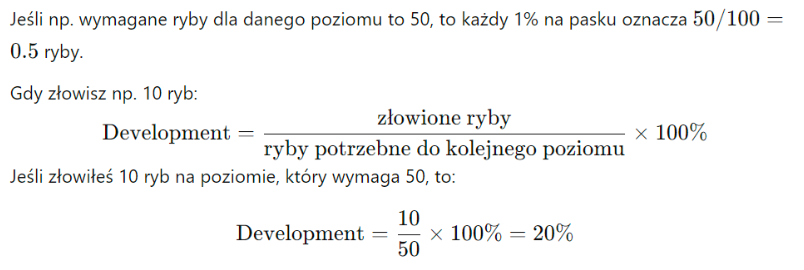

# System Wędkarza

Aby zostać wędkarzem, należy najpierw zostać czeladnikiem u mistrza wędkarzy, który krok po kroku nauczy gracza, jak skutecznie łowić ryby.

Dzięki łowieniu ryb gracz może zdobywać przedmioty niezbędne do tworzenia potraw, a unikalne gatunki ryb zawierają rzadkie materiały wykorzystywane do tworzenia specjalnych przedmiotów.

Dodatkowo umiejętność łowienia ryb wpływa na ogólne statystyki postaci. Im postać jest lepsza w łowieniu, tym staje się mocniejsza. Podnoszone statystyki wynikają z wpływu rybołówstwa, np. zwiększając siłę, zręczność i inteligencję.

Maksymalny poziom umiejętności wędkarskich wynosi **100**.

Rzadkość ryby wpływa na trudność mini-gry. Poziom wędkarza wpływa na możliwość łowienia trudniejszych, unikalnych ryb, które zawierają cenne przedmioty.

## Czynniki wpływające na rzadkość i wartość łowionych ryb

- **Miejsce**: Niektóre ryby można złowić wyłącznie w określonych lokalizacjach, np. w podziemnym jeziorze w jaskini pełnej potworów.
- **Przynęty**: Rzadkie przynęty, jak specjalne kwiaty lub świecące kamienie, mogą przyciągać unikalne gatunki ryb.
- **Pora dnia i wydarzenia**: Niektóre ryby pojawiają się tylko w nocy lub podczas cyklicznych zjawisk, np. ryba głębinowa wypływająca jedynie podczas zaćmienia księżyca.

## Mechanika łowienia

Po kliknięciu w obiekt wodny i wybraniu opcji łowienia, uruchamia się mini-gra.

- Należy obserwować spławik i wędkę, które wskazują moment brania.
- Różne sygnały graficzne pomagają określić, kiedy należy wyciągnąć rybę.
- Aby wyciągnąć rybę, trzeba kliknąć lewy i prawy przycisk myszy oraz poruszyć nią do siebie.

Możliwe jest zaimplementowanie systemu inspirowanego mechaniką z **Sea of Thieves**.

## System obliczania poziomu wędkarza

Wzór na obliczanie wymaganej liczby ryb do osiągnięcia kolejnego poziomu:

```text
n -> poziom wędkarza
Poziom wędkarza = Poziom wędkarza + 4n + 1
```

## Interfejs

Interfejs wykorzystuje pasek postępu, który pokazuje progres w zdobywaniu kolejnych poziomów umiejętności.



## Statystyki związane z łowieniem

Statystyki wzrastają co 5 poziomów według następującego schematu:

```text
n - indeks poziomu gwarantującego bonus
```

| Poziom wędkarza | Indeks |
|-----------------|--------|
| Poziom 5        | n = 1  |
| Poziom 10       | n + 1  |
| Poziom 15       | n + 2  |
| ... | |

Każdy kolejny poziom zwiększa odpowiednie statystyki:

- **Dexterity bonus** = dexterity bonus + 1*n
- **Precision bonus** = precision bonus + 1*n
- **Evasion bonus** = evasion bonus + 1*n
- **M accuracy bonus** = M accuracy bonus + 1.25*n
- **P accuracy bonus** = P accuracy bonus + 1.25*n
- **Fishing power bonus** = fishing power bonus + 1*n

## Propozycja programu realizującego dany problem

```cpp
#include <iostream>
#include <cstdlib>     // dla rand() i srand()
#include <ctime>       // dla time()
#include <chrono>      // dla std::chrono
#include <thread>      // dla std::this_thread::sleep_for
#include <conio.h>     // dla _kbhit() i _getch()


class Wedkarz {
private:
    int poziom;
    int doswiadczenie;
    int doswiadczenie_do_nastepnego_poziomu;
    int n; // indeks dla systemu piątek


    // Statystyki
    int zr_recznosc_bonus;
    int precyzja;
    int uniki;
    double m_celnosc;
    double p_celnosc;


public:
    Wedkarz() : poziom(1), doswiadczenie(0), doswiadczenie_do_nastepnego_poziomu(0),
                n(0), zr_recznosc_bonus(0), precyzja(0), uniki(0), m_celnosc(0.0), p_celnosc(0.0) {
        oblicz_doswiadczenie_do_nastepnego_poziomu();
        // Inicjalizacja generatora liczb losowych
        srand(static_cast<unsigned int>(time(0)));
    }


    void oblicz_doswiadczenie_do_nastepnego_poziomu() {
        int n = poziom;
        doswiadczenie_do_nastepnego_poziomu = doswiadczenie + 2 * n + (2 * n + 1);
    }


    void lowienie_ryby() {
        // Symulacja łowienia ryby
        std::cout << "Zarzucasz wędkę. Obserwuj spławik...\n";


        // Losowy czas oczekiwania na branie (od 2 do 5 sekund)
        int czas_oczekiwania = 2 + rand() % 4;
        std::this_thread::sleep_for(std::chrono::seconds(czas_oczekiwania));


        // Symulacja brania ryby
        std::cout << "Ryba bierze! Szybko nacisnij lewy (L) i prawy (P) przycisk myszy, a nastepnie szybko porusz myszą do siebie (wcisnij klawisz 'S').\n";
        std::cout << "Masz 3 sekundy na reakcje!\n";


        auto start = std::chrono::steady_clock::now();
        bool lewy_przycisk = false;
        bool prawy_przycisk = false;
        bool porusz_mysza = false;


        while (std::chrono::steady_clock::now() - start < std::chrono::seconds(3)) {
            if (_kbhit()) {
                char ch = _getch();
                if (ch == 'L' || ch == 'l') {
                    lewy_przycisk = true;
                    std::cout << "Lewy przycisk myszy wcisniety.\n";
                } else if (ch == 'P' || ch == 'p') {
                    prawy_przycisk = true;
                    std::cout << "Prawy przycisk myszy wcisniety.\n";
                } else if (ch == 'S' || ch == 's') {
                    porusz_mysza = true;
                    std::cout << "Poruszyles myszą do siebie.\n";
                }
            }
            if (lewy_przycisk && prawy_przycisk && porusz_mysza) {
                break;
            }
        }


        // Sprawdzenie czy gracz zdążył zareagować poprawnie
        if (lewy_przycisk && prawy_przycisk && porusz_mysza) {
            std::cout << "Udało Ci się złowić rybę!\n";
            zdobywaj_doswiadczenie(10); // Przyjmijmy, że za każdą rybę dostajemy 10 punktów doświadczenia
        } else {
            std::cout << "Niestety, ryba uciekła...\n";
        }
    }


    void zdobywaj_doswiadczenie(int ilosc) {
        doswiadczenie += ilosc;
        std::cout << "Zdobyto " << ilosc << " punktów doświadczenia.\n";
        sprawdz_awans();
    }


    void sprawdz_awans() {
        if (doswiadczenie >= doswiadczenie_do_nastepnego_poziomu) {
            awansuj();
        }
    }


    void awansuj() {
        poziom++;
        std::cout << "Gratulacje! Awansowałeś na poziom " << poziom << ".\n";
        oblicz_doswiadczenie_do_nastepnego_poziomu();


        if (poziom % 5 == 0) {
            n++;
            aktualizuj_statystyki();
        }
    }


    void aktualizuj_statystyki() {
        zr_recznosc_bonus += 1 * n;
        precyzja += 1 * n;
        uniki += 1 * n;
        m_celnosc += 1.25 * n;
        p_celnosc += 1.25 * n;


        std::cout << "Twoje statystyki zostały zaktualizowane!\n";
        wypisz_statystyki();
    }


    void wypisz_statystyki() {
        std::cout << "Statystyki:\n";
        std::cout << "Zręczność bonus: " << zr_recznosc_bonus << "\n";
        std::cout << "Precyzja: " << precyzja << "\n";
        std::cout << "Uniki: " << uniki << "\n";
        std::cout << "M celnosc: " << m_celnosc << "\n";
        std::cout << "P celnosc: " << p_celnosc << "\n";
    }


    void wypisz_stan() {
        std::cout << "Poziom: " << poziom << "\n";
        std::cout << "Doświadczenie: " << doswiadczenie << "/" << doswiadczenie_do_nastepnego_poziomu << "\n";
    }
};


int main() {
    Wedkarz wedkarz;


    char wybor;
    do {
        std::cout << "Co chcesz zrobić?\n";
        std::cout << "1. Łowić ryby\n";
        std::cout << "2. Sprawdzić statystyki\n";
        std::cout << "3. Wyjść\n";
        std::cin >> wybor;


        switch (wybor) {
            case '1':
                wedkarz.lowienie_ryby();
                break;
            case '2':
                wedkarz.wypisz_stan();
                wedkarz.wypisz_statystyki();
                break;
            case '3':
                std::cout << "Do zobaczenia!\n";
                break;
            default:
                std::cout << "Nieznana opcja.\n";
                break;
        }
        std::cout << "------------------------\n";
    } while (wybor != '3');


    return 0;
}
```
