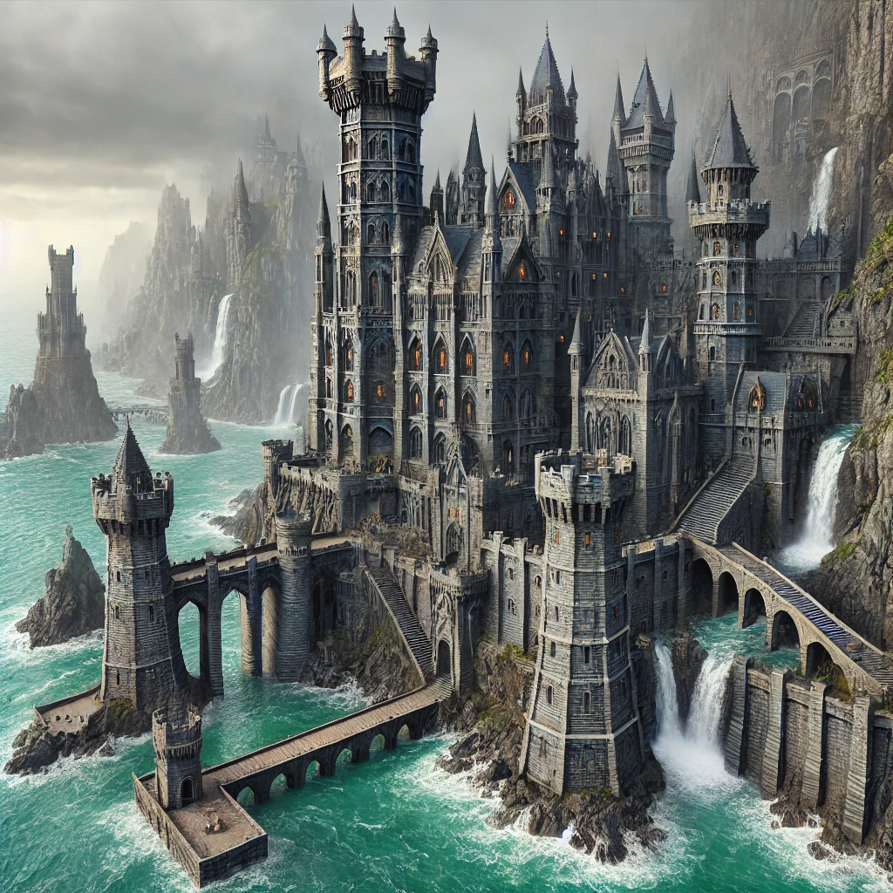
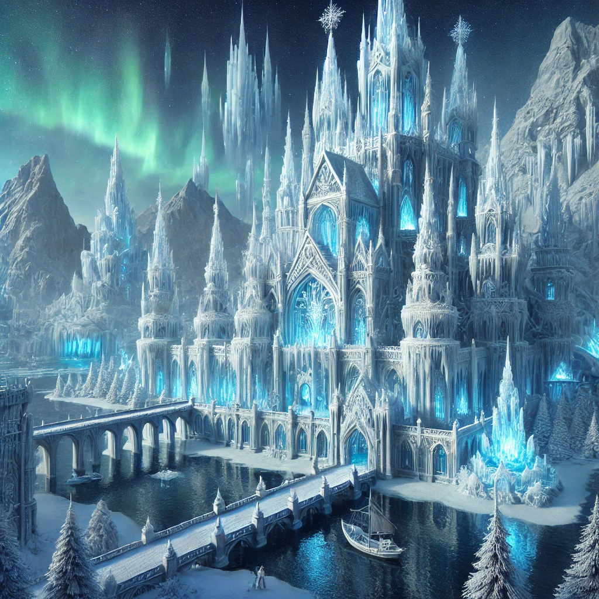
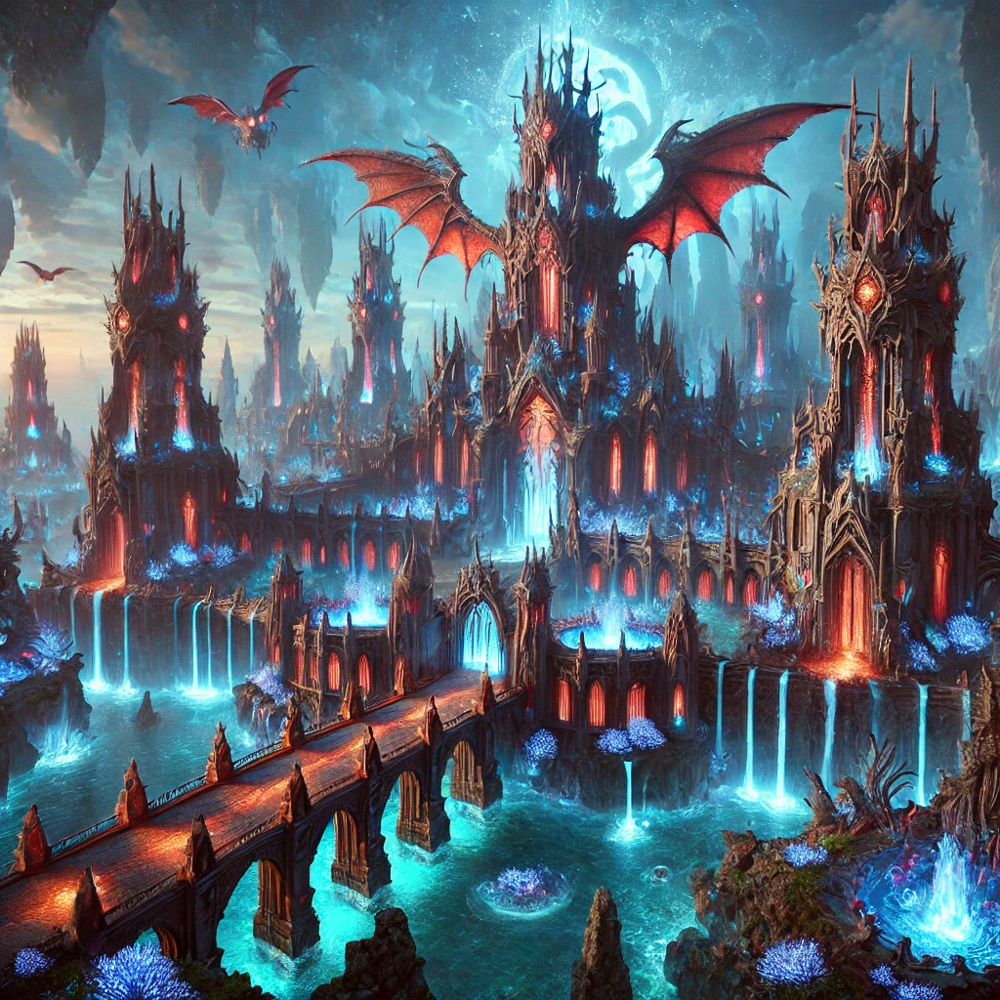

# System Zamków

System zamków dzieli się na kilka etapów i obejmują całą strukturę jak wygląda personalizacja i kontrola zamku, jakie ma funkcje zamek, kto jest liderem zamku, jakie są benefity zamku oraz siege.

## Plan Techniczny Zamku

1. Przednie Mury i Fosa

   - **Fosa**:
     - Otacza cały zamek, szeroka i głęboka, uniemożliwia bezpośrednie podejście pod mury.
     - Wypełniona wodą lub sucha (z kolcami na dnie w wersji suchej).
   - **Wejścia**:
     - **Główne Wejście (Barbakan)**:
       - Monumentalne, zabezpieczone zwodzonym mostem nad fosą.
       - Most prowadzi do podwójnej bramy z ciężkimi żelaznymi wrotami oraz kratownicą.
     - **Tylne Wejście**:
       - Mniejsze, bardziej ukryte, przeznaczone głównie dla zaopatrzenia i ucieczki.
     - **Dwa Ukryte Wejścia**:
       - Tunelowe przejścia, jedno prowadzące do fosy (do wodopoju), drugie w głąb lasu lub innego naturalnego schronienia.
     - **Pięć Wyjść na Mury**:
       - Schody i rampy rozmieszczone równomiernie wzdłuż muru dla łatwego dostępu.
   - **Wieże**:
     - Regularnie rozmieszczone na murach.
     - Wyposażone w mangonelle, balisty lub inne machiny oblężnicze.
     - Część wież ma miejsce na duże magazyny broni, aby szybko uzupełniać amunicję.
   - **Mury**:
     - Część zwykła: solidna kamienna konstrukcja.
     - Część ochronna: wzmocniona, z wewnętrznymi przejściami dla załogi, dodatkowymi wieżyczkami i punktami obserwacyjnymi.

2. Dolna Część Zamku (Przedzamcze)

   - **Funkcje**:
     - **Zbrojownia**: Magazyn broni, pancerzy i amunicji.
     - **Stajnie**: Dla koni rycerzy i zwierząt pociągowych.
     - **Skład Zapasów**: Magazyny na żywność, wodę i materiały budowlane.
     - **Kwatera Garnizonu**: Pomieszczenia dla straży i żołnierzy zamkowych.
     - **Warsztaty Rzemieślnicze**: Kuźnie, warsztaty cieśli i innych fachowców.
     - **Wieża Alarmowa**: Najwyższy punkt w dolnej części zamku, służy do sygnalizowania zagrożeń.
   - **Układ**:
     - Rozplanowanie skoncentrowane na funkcjonalności: stajnie i kuźnie blisko bram, zbrojownia centralnie.

3. Środkowa Część Zamku (Przedbramie)

   - **Wejście do Górnej Części Zamku**:
     - Znajduje się tu kolejny system bram z kratownicą.
     - Schody lub rampy prowadzące w górę.
   - **Plac Centralny**:
     - Miejsce zebrań lub formowania oddziałów w razie obrony.
     - Studnia główna zaopatrzona w podziemne kanały.
   - **Budynki**:
     - **Kaplica Zamkowa**: Dla celów religijnych i duchowego wsparcia obrońców.
     - **Dom Zarządcy**: Siedziba dla oficera nadzorującego dolną część zamku.

4. Główna Siedziba Zamku (Górna Część)

   - **Zamek Właściwy**:
     - **Wieża Donżon**:
       - Centralny punkt obrony.
       - Siedziba pana zamku.
       - Grube mury, zapasy jedzenia i wody na długi czas oblężenia.
     - **Sala Rycerska**: Miejsce zebrań i narad.
     - **Komnaty Lorda**: Prywatne apartamenty dla władcy i jego rodziny.
     - **Biblioteka**: Gromadzi mapy, zapiski i księgi.
   - **Dodatkowe Budynki**:
     - **Mennica Zamkowa**: W przypadku zamków posiadających własną walutę.
     - **Szpital**: Dla rannych podczas oblężenia.
     - **Kuchnia i Spiżarnia**: Blisko donżonu, dla zapewnienia bezpośredniego dostępu.

5. Opcjonalna Trzecia lub nawet czwarta i piąta Część Zamku (Zamek Wewnętrzny)

   - **Dodatkowe Przedbramie**:
     - Kolejna warstwa obrony, dostępna w zamkach większych i bardziej rozbudowanych.
   - **Rezerwowe Składy**:
     - Magazyny strategiczne na dłuższe oblężenia.
   - **Tajemne Przejścia**:
     - Ukryte korytarze prowadzące na zewnątrz zamku lub do kluczowych miejsc, np. dungeonu.

## Otoczenie i Układ Geograficzny

1. **Rzeka:**
    - **Układ:**
        - Rzeka otacza zamek w kształcie litery "U", tworząc naturalną fosę i skutecznie izolując go od większości kierunków natarcia.
        - Brzegi rzeki są strome i skaliste, co dodatkowo utrudnia przeprawę i uniemożliwia łatwe podejście pod mury.
    - **Mosty:**
        - **Północny Most:**
            - Zwodzony, wąski, pozwalający na przejście jedynie kilku jednostek jednocześnie.
            - Zabezpieczony bramą i kratownicą (portcullis).
        - **Południowy Most:**
            - Również zwodzony i wąski, prowadzący do otwartego pola.
            - Używany głównie do wyprowadzania wojsk na zewnątrz lub jako wyjście awaryjne.
2. **Otwarte Pola Wokół Rzeki:**
    - **Wschodnia Strona:**
        - Pustynny, równinny teren z minimalną roślinnością.
        - Odsłonięty obszar, idealny dla ostrzału artyleryjskiego i łuczników.
        - Wyposażony w ukryte pułapki: wilcze doły, kolczaste bariery i zapadnie.
    - **Zabezpieczenia:**
        - Patrole konne monitorujące ruchy wroga.
        - Oznaczone ścieżki dla własnych oddziałów, aby unikać pułapek.
3. **Roślinność:**
    - **Zachodnia Strona:**
        - Gęsto zalesiona, stanowiąca źródło drewna i materiałów budowlanych.
        - **Obrona:**
            - Ukryte posterunki obserwacyjne i wieże strażnicze.
            - Pułapki i zasadzki w razie próby ataku przez las.
        - **Kontrola:**
            - Ścieżki leśne kontrolowane i oznakowane, z możliwością zablokowania w razie zagrożenia.

## Fortyfikacje Zewnętrzne

1. **Mury Zewnętrzne:**
    - **Konstrukcja:**
        - Wykonane z solidnych bloków kamiennych, wysokość około 12 metrów, grubość 3 metry.
        - **Elementy Obronne:**
            - Krenelaż (zębate zwieńczenia) dla ochrony strzelców.
            - Machikuły (wystające galerie z otworami w podłodze) do rażenia wroga gorącą cieczą, kamieniami czy strzałami.
            - Strzelnice o różnych kształtach (krzyżowe dla kusz, szczelinowe dla łuków).
2. **Wieże Zewnętrzne:**
    - **Rozmieszczenie:**
        - Co 50 metrów wzdłuż murów, zapewniając pełne pokrycie ogniem obronnym.
    - **Konstrukcja:**
        - Okrągłe, trzy poziomy:
            - **Dolny Poziom:** Magazyny amunicji i schronienie.
            - **Środkowy Poziom:** Stanowiska łuczników i kuszników.
            - **Górny Poziom:** Machiny miotające (balisty, katapulty).
    - **Łączność:**
        - Połączone z murami krytymi chodnikami, chroniącymi przed ostrzałem.
3. **Bramy i Barbakan:**
    - **Główna Brama Północna:**
        - **Barbakan:** Wysunięta przed mury dodatkowa fortyfikacja z własnymi murami i wieżami.
        - **Zabezpieczenia:**
            - Zwodzony most nad fosą.
            - Podwójne wrota z żelaza.
            - Kratownica (portcullis) i mordercze otwory (murder holes) w stropie bramy.
    - **Brama Południowa:**
        - Mniejsza, dyskretniejsza, z podobnymi zabezpieczeniami.
        - Umożliwia szybkie wypady kawalerii.
4. **Fosy:**
    - **Konstrukcja:**
        - Szeroka na 10 metrów, głęboka na 5 metrów.
        - Wypełniona wodą z rzeki, kontrolowana przez system śluz.
    - **Obrona:**
        - Ostre pale (chevaux-de-fraise) pod wodą.
        - Możliwość spuszczenia wody w celu zaskoczenia wroga.

## Fortyfikacje Wewnętrzne

1. **Mury Wewnętrzne:**
    - **Konstrukcja:**
        - Wysokość 8 metrów, grubość 2,5 metra.
        - Wyposażone w krenelaż i machikuły.
    - **Funkcje:**
        - Druga linia obrony w razie przełamania murów zewnętrznych.
        - Chronią cytadelę i budynki kluczowe.
2. **Wieże Wewnętrzne:**
    - **Konstrukcja:**
        - Prostokątne, wyższe niż mury wewnętrzne.
        - Wyposażone w strzelnice i stanowiska dla machin miotających.
    - **Funkcje:**
        - Punkty dowodzenia i obserwacji.
        - Schronienie dla dowództwa w razie intensywnego ataku.
3. **Brama Wewnętrzna:**
    - **Zabezpieczenia:**
        - Podwójne wrota, kratownica, mordercze otwory.
        - Dodatkowe pułapki, takie jak zapadnie czy boczne strzelnice.

## Cytadela

1. **Donżon (Wieża Główna):**
    - **Konstrukcja:**
        - Wysokość 30 metrów, mury o grubości do 5 metrów.
        - Odporna na ostrzał artyleryjski i próby podkopów.
    - **Wnętrze:**
        - **Piwnice:** Lochy, magazyny żywności i wody.
        - **Parter:** Zbrojownia, sala rycerska.
        - **Wyższe Piętra:** Komnaty lordowskie, biblioteka, kaplica.
        - **Szczyt:** Platforma obserwacyjna, machiny oblężnicze (trebusze, mangonelle).
2. **Plac Wewnętrzny:**
    - **Funkcje:**
        - Miejsce formowania oddziałów.
        - Organizacja wydarzeń i ceremonii.
    - **Infrastruktura:**
        - Studnia głębinowa z czystą wodą.
        - Cysterny na wodę deszczową.

## Budynki Wewnętrzne

1. **Koszary:**
    - **Konstrukcja:**
        - Pomieszczenia dla 200–300 żołnierzy.
        - Oddzielne sekcje dla różnych formacji (piechota, kawaleria, łucznicy).
    - **Wyposażenie:**
        - Sale treningowe, zbrojownię, jadalnie.
2. **Zbrojownia:**
    - **Funkcje:**
        - Przechowywanie broni, zbroi, amunicji.
        - Warsztaty naprawcze i produkcyjne.
    - **Zabezpieczenia:**
        - Grube mury, zabezpieczone drzwi, kontrolowany dostęp.
3. **Warsztaty Rzemieślnicze:**
    - **Rodzaje:**
        - Kuźnie, warsztaty cieśli, garbarzy, szewców.
    - **Lokalizacja:**
        - W bezpiecznej części zamku, z dobrą wentylacją.
4. **Spichlerz i Magazyny:**
    - **Funkcje:**
        - Przechowywanie żywności na minimum 6 miesięcy.
        - Zapasy soli, przypraw, zboża, mięsa suszonego.
    - **Zabezpieczenia:**
        - Ochrona przed szkodnikami, wilgocią, pożarem.
5. **Szpital i Chata Medyka:**
    - **Wyposażenie:**
        - Sale dla rannych, pomieszczenia do przechowywania ziół i leków.
        - Narzędzia chirurgiczne i opatrunki.
    - **Personel:**
        - Medyk, pomocnicy, zielarze.
6. **Kaplica/Katedra:**
    - **Funkcje:**
        - Miejsce kultu, podnoszenie morale.
        - Schronienie dla ludności cywilnej.
7. **Kuchnie i Piekarnie:**
    - **Wyposażenie:**
        - Duże piece, magazyny żywności.
        - Miejsce przygotowywania posiłków dla całego garnizonu.

## Elementy Dodatkowe

1. **Tajemne Przejścia i Wyjścia Awaryjne:**
    - **Funkcje:**
        - Umożliwiają ucieczkę, dostarczanie zaopatrzenia, zaskakujące ataki.
    - **Zabezpieczenia:**
        - Ukryte wejścia, pułapki na intruzów, znane tylko nielicznym.
2. **System Komunikacji:**
    - **Metody:**
        - Dzwony, flagi sygnałowe, ognie sygnałowe.
    - **Funkcje:**
        - Szybkie przekazywanie informacji o zagrożeniach.
3. **Sally Ports (Wyłomy):**
    - **Funkcje:**
        - Małe wyjścia do nagłych wypadów.
    - **Lokalizacja:**
        - Ukryte w murach, zabezpieczone i monitorowane.
4. **System Kanalizacyjny i Sanitarny:**
    - **Konstrukcja:**
        - Kanalizacja odprowadzająca ścieki poza zamek.
    - **Higiena:**
        - Latryny z dala od źródeł wody, regularnie czyszczone.

## Jednostki Obronne

1. **Łucznicy i Kusznicy:**
    - **Rozmieszczenie:**
        - Mury, wieże, barbakan.
    - **Wyposażenie:**
        - Wysokiej jakości łuki, kusze, zapas strzał i bełtów.
2. **Pikinierzy i Piechota:**
    - **Funkcje:**
        - Obrona bram, walka wręcz.
    - **Wyposażenie:**
        - Piki, miecze, tarcze, zbroje.
3. **Kawaleria:**
    - **Funkcje:**
        - Szybkie wypady, zwiad.
    - **Wyposażenie:**
        - Konie bojowe, zbroje płytowe, lance.
4. **Inżynierowie i Saperzy:**
    - **Funkcje:**
        - Obsługa machin, naprawy, przeciwdziałanie podkopom.
    - **Wyposażenie:**
        - Narzędzia, materiały budowlane.
5. **Alchemicy i Strażnicy Ognia:**
    - **Funkcje:**
        - Obsługa substancji zapalających, materiałów wybuchowych.
    - **Wyposażenie:**
        - Ogień grecki, proch, eliksiry.

## Obszary Poza Murami

1. **Farmy i Sady:**
    - **Funkcje:**
        - Produkcja żywności, pasza dla zwierząt.
    - **Zabezpieczenia:**
        - Otoczone palisadą, strażnice.
2. **Wieże Strażnicze:**
    - **Lokalizacja:**
        - Względy strategiczne, wzniesienia, skrzyżowania dróg.
    - **Funkcje:**
        - Wczesne ostrzeganie, sygnalizacja.
3. **Drogi i Ścieżki:**
    - **Kontrola:**
        - Patrole, punkty kontrolne.
    - **Zabezpieczenia:**
        - Możliwość zablokowania, pułapki.

## Dodatkowe Środki Obronne

1. **Pułapki i Zasadzki:**
    - **Rodzaje:**
        - Wilcze doły, zapadnie, kolce.
    - **Lokalizacja:**
        - Przedpole zamku, podejścia do murów.
2. **Magazyny Rezerwowe:**
    - **Funkcje:**
        - Zapas broni, żywności na wypadek długiego oblężenia.
    - **Lokalizacja:**
        - Ukryte, zabezpieczone miejsca w zamku.
3. **Systemy Gaśnicze:**
    - **Wyposażenie:**
        - Cysterny z wodą, piasek, sprzęt gaśniczy.
    - **Funkcje:**
        - Szybkie reagowanie na pożary spowodowane np. przez ogniste strzały.

## Propozycje graficzne

### Zamek Przystani Herosów

### Zamek Wiecznej Chwały

### Zamek Nad Cliffem Sokolim

### Zamek Druidów

### Zamek Magmowej Ściany

### Zamek Pana Ciemności

### Zamek Wiecznego Lodu

### Zamek Arcymagów

### Zamek Światłości Pana

### Zamek Behemotów

### Zamek Smoków

### Zamek Orków

### Zamek Lewiatanów

### Zamek Wyrmów

### Zamek Elfów

### Zamek krasnoludów

### Zamek Asasynów

### Zamek Barbarzyńców

## System zarządzania zamkiem

- System dzieli się na zarządzanie najemnikami
- System zarządzania budynkami (ich stan utrzymanie)
- System zarządzania podatkami przypisanymi do danego terytorium
- System wspierania Fortec i otrzymania wsparcia od Fortec
- System zarządzania informacjami o zamku i problemami

## System Zarządzania Najemnikami

1. **Grupy Najemników Zamiast Jednostek:**
    - Najemnicy są podzieleni na grupy według ich typów (np. piechota, kawaleria, łucznicy, inżynierowie).
    - Każda grupa ma swój własny ekwipunek i statystyki, które można ulepszać jako całość, zamiast zarządzać jednostkami pojedynczo.
2. **Ulepszanie Ekwipunku:**
    - Gracz inwestuje złoto w ulepszenia dla całej grupy, np.:
        - Piechota: Lepsze tarcze i zbroje → zwiększona obrona.
        - Łucznicy: Mocniejsze łuki i bełty → zwiększone obrażenia.
        - Kawaleria: Wytrzymalsze konie i lżejsze zbroje → większa mobilność.
    - Wybór ulepszeń odbywa się w prostym menu, które wyświetla koszty i efekty.
3. **Koszt Utrzymania:**
    - Każda grupa wymaga regularnego żołdu. Brak środków oznacza mniejszą efektywność lub dezercję.
    - Gracz może zredukować liczbę najemników, jeśli finanse na to nie pozwalają.

## Misje dla Najemników

1. **System Zleceń:**
    - Gracz może wysyłać grupy najemników na misje NPC, takie jak:
        - Patrolowanie granic.
        - Ekspedycje w celu zdobycia zasobów.
        - Obrona sojuszników.
    - Misje są podzielone na poziomy trudności, a ich powodzenie zależy od jakości grupy i ekwipunku.
2. **Zasoby i Nagrody:**
    - Wykonywanie misji daje:
        - Złoto.
        - Doświadczenie dla grupy (podnoszące ich poziom).
        - Rzadkie surowce do budowy lub ulepszania zamku.

## Zarządzanie Grupami w Oblężeniach

1. **Formacje i Role:**
    - Gracz wybiera formacje i role dla grup, np.:
        - Piechota w roli defensywnej przy bramach.
        - Kawaleria do szybkich ataków flankujących.
        - Inżynierowie do obsługi machin oblężniczych.
2. **Zautomatyzowane Starcia:**
    - Podczas walki najemnicy automatycznie wykonują swoje role, jednak gracz może wydawać ogólne rozkazy (np. "szturmuj bramę", "skup się na wrogiej kawalerii").
3. **Machiny Oblężnicze:**
    - Grupy inżynierów mogą obsługiwać trebusze, balisty i tarany.
    - Lepsze narzędzia i szkolenia zwiększają efektywność ich działań.

## Dynamiczny System Rozwoju

1. **Postęp Technologiczny:**
    - Gracz może rozwijać technologię wojskową zamku, odblokowując lepsze typy uzbrojenia i umiejętności grup.
    - Przykładowo:
        - Łucznicy z dostępem do płonących strzał.
        - Piechota z możliwością stawiania zapór.
        - Kawaleria ze specjalnymi szarżami.
2. **Balans Ekonomii:**
    - Każdy ulepszony sprzęt zwiększa koszt utrzymania grupy, co wymaga lepszego zarządzania finansami zamku.

## Integracja z PvP

1. **Personalizacja Armii:**
    - Gracze mogą dostosować swoją armię do stylu gry klanu lub zamku:
        - Obrona: Mocna piechota i inżynierowie.
        - Atak: Mobilna kawaleria i trebusze.
        - Hybryda: Zrównoważona armia.
2. **Interakcja z NPC:**
    - NPC-najemnicy są bardziej przewidywalni, co pozwala na dynamiczne kontrakty między graczami (np. wynajęcie części armii od sojusznika).
3. **Nagrody za Oblężenia:**
    - Wprowadzenie systemu, w którym zdobycie zamku oznacza większe przychody z danin lub dostęp do unikalnych zasobów.

## System Zarządzania Budynkami

*Opis Systemu:*

- Budynki w zamku mają swój stan techniczny. Po oblężeniu czy naturalnym zużyciu mogą wymagać naprawy.
- Ulepszanie budynków daje dostęp do nowych funkcji lub zwiększa ich efektywność.

*Elementy Systemu:*

1. **Stan Techniczny Budynków:**
    - Każdy budynek ma pasek stanu, który spada po oblężeniu lub w wyniku eksploatacji.
    - Naprawy wymagają surowców (drewno, kamień, metal) i złota.
2. **Kategorie Budynków:**
    - **Obronne:** Wieże, mury, bramy (wpływają na czas i skuteczność oblężenia).
    - **Użytkowe:** Kuźnia, spichlerze, studnie (zwiększają produkcję, przechowywanie zasobów itp.).
    - **Militarne:** Koszary, warsztaty machin oblężniczych (wpływają na dostępne jednostki i ich jakość).
    - **Administracyjne:** Sala tronowa, skarbiec (zarządzanie podatkami, najemnikami).
3. **Zarządzanie:**
    - Gracz ma prostą mapę zamku, gdzie kliknięciem wybiera budynki do naprawy
    - Małej customizacji

## System Zarządzania Podatkami

*Opis Systemu:*

- Region kontrolowany przez gracza generuje przychody z podatków, zależne od aktywności gospodarczej (produkcja, handel, populacja).

*Elementy Systemu:*

1. **Rodzaje Podatków:**
    - **Podatek od handlu:** Procent od transakcji na rynku.
    - **Podatek rolny:** Pobierany od plonów i hodowli.
    - **Podatek od rzemiosła:** Pobierany od wytwórców (np. kowali, cieśli).
2. **Zarządzanie Stawkami:**
    - Gracz ustala stawki podatkowe w granicach (np. 5–20%).
    - Wyższe podatki dają większy dochód, ale mogą obniżyć zadowolenie mieszkańców.
3. **Przychód do Skarbca:**
    - Zebrane podatki trafiają do skarbca zamkowego.
    - Fundusze można wykorzystać na:
        - Naprawę/ulepszanie budynków.
        - Opłacanie żołdu najemnikom.
        - Finansowanie misji i ekspedycji.

## System Wspierania Fortec

*Opis Systemu:*

- Forteca jako odnoga centralnego zamku pełni funkcję wspierającą w obronie lub ekspansji.

*Elementy Systemu:*

1. **Emisariusze:**
    - Wysyłani z zamku głównego do fortec w celu:
        - Zbierania informacji o stanie fortec.
        - Przekazywania rozkazów i zasobów.
    - W przypadku braku komunikacji, efektywność fortec spada.
2. **Wsparcie Wojskowe:**
    - Możliwość wysłania grup najemników, zasobów lub machin oblężniczych do fortec.
    - Forteca może dostarczyć pomoc do zamku głównego w razie oblężenia.
3. **Forteca jako Punkt Strategiczny:**
    - Zwiększa kontrolę nad regionem, wpływając na podatki i dostępność zasobów.
    - Odpowiednio zarządzana forteca zwiększa czas trwania oblężenia zamku głównego.

## System Zarządzania Informacjami i Problemami

*Opis Systemu:*

- Centralny panel dostarczający informacji o zamku, fortecach i regionie.

*Elementy Systemu:*

1. **Informacje o Zamku:**
    - Stan techniczny budynków.
    - Liczba najemników, ich morale i stan.
    - Aktualny poziom zasobów (złoto, drewno, kamień, żywność).
2. **Problemy Wieśniaków:**
    - Skargi o wysokie podatki, problemy z bezpieczeństwem, głód.
    - Rozwiązanie problemów poprawia zadowolenie, co wpływa na dochody i rekrutację.
3. **Zlecanie Zadań:**
    - Możliwość wydawania rozkazów jednostkom:
        - Obrona zamku lub fortec.
        - Przeprowadzanie patroli.
        - Ekspedycje w celu zdobycia zasobów.
4. **Wskaźniki Sukcesu:**
    - Ogólne morale mieszkańców i armii.
    - Efektywność zarządzania (np. niski poziom problemów, wysoka produkcja).

## System strategii w grze

### Strategia Domina z Asasynami

- **Nieprzewidywalność:** Asasyni działają w ukryciu, co sprawia, że trudno ich przewidzieć. Ich zdolność do infiltracji i zniszczenia kluczowych punktów zamku zmusza przeciwników do bycia stale czujnymi.
- **Niski koszt ryzyka:** Nawet jeśli większość asasynów poniesie porażkę, wystarczy sukces jednego lub dwóch, aby zniszczyć kluczowe elementy zamku (mury, bramy, zasoby).
- **Dynamiczna taktyka:** Strategia wymusza dynamiczne zmiany w obronie zamku – gracze nie mogą polegać tylko na swoich NPC-ach, muszą być aktywni i reagować szybko.

### Strategia Żółwia

- **Skupienie sił:** Strategia ta pozwala na maksymalne skoncentrowanie zasobów i obrony w kilku kluczowych lokacjach. To czyni atak na takie zamki trudnym, czasochłonnym i kosztownym.
- **Kontrola mapy:** Nawet jeśli część zamków zostaje utracona, żółw zachowuje kluczowe punkty, które są w stanie przechowywać duże zasoby i elitarne armie.
- **Ekonomiczne podejście:** Dzięki ograniczeniu liczby obronnych zamków, żółw może inwestować w ich utrzymanie i rozbudowę, tworząc niemal niezdobytą twierdzę.

---

**Standardowe strategie oblężenia, jak bezpośredni atak z machinami oblężniczymi, są bardziej prostolinijne i mniej elastyczne.**

### Kluczowe Mechaniki Limitu i Kary

1. **Podstawowy Limit: 120 jednostek**
    - Każdy zamek ma bazowy limit rekrutacji 120 jednostek.
    - Limit obejmuje wszystkie typy jednostek, w tym najemników i NPC-ów rekrutowanych lokalnie.
2. **Kary za przekroczenie limitu:**
    - **Podwójne koszty utrzymania za każdą jednostkę powyżej limitu.**
        - Mechanika: Jeśli gracz utrzymuje 140 jednostek w zamku, dodatkowe 20 jednostek kosztuje dwa razy więcej w utrzymaniu.
    - **Spadek morale wśród jednostek:**
        - Przy nadmiernym tłoku efektywność bojowa spada, co odbija się na ich wydajności w walce.
    - **Problemy logistyczne:**
        - Więcej jednostek oznacza wolniejsze reagowanie na rozkazy w obronie i większe trudności w zarządzaniu.

### Transport Jednostek

- **Mechanika przenoszenia armii:**
  - Jednostki można przenosić między zamkami i fortami za pomocą specjalnych transportów (karawan, statków, czy magicznych portali, jeśli dostępne).
  - Transport trwa określony czas, w zależności od odległości między zamkami.
  - Gracze mogą być atakowani podczas transportu armii, co wprowadza dodatkowy element ryzyka.
- **Zarządzanie rezerwami:**
  - Jednostki, które nie mieszczą się w danym zamku, mogą być automatycznie przydzielane do rezerw, co zmniejsza ich koszty utrzymania, ale nie są dostępne do obrony zamku.

### Balansowanie Ekonomiczne

1. **Koszty utrzymania:**
    - Każda jednostka ma określony koszt utrzymania (złoto, żywność, zasoby).
    - Koszty rosną dynamicznie w przypadku przekraczania limitów.
2. **Mechanika dochodów:**
    - Wysokie podatki mogą zwiększyć dochody, ale zmniejszają morale wieśniaków i prowadzą do buntów.
    - Inwestowanie w infrastrukturę (np. spichlerze, magazyny) zmniejsza koszty utrzymania jednostek.

### Korzyści z Elastycznego Limitu

1. **Rozwinięcie strategii żółwia:**
    - Gracze, którzy inwestują w kilka silnie bronionych zamków, będą mieć większe szanse w dłuższej perspektywie.
    - Zmusza przeciwników do organizowania wielu oblężeń lub wykorzystania mechanik sabotażu.
2. **Dynamiczne rozgrywki PvP:**
    - Przenoszenie jednostek w odpowiednim momencie może być kluczowe do skutecznej obrony lub przełamania linii wroga.
3. **Zrównoważone zarządzanie zasobami:**
    - Gracze muszą podejmować decyzje, czy inwestować w więcej armii, czy rozwój infrastruktury zamku.

### Dodatkowe Mechaniki Wspierające

- **Morale:**
    Jednostki mogą uciekać z pola walki, jeśli morale spadnie z powodu przekroczenia limitu lub porażek.
- **System rankingowy:**
    Każdy zamek może mieć wskaźnik prestiżu, który zwiększa się dzięki wygranym bitwom i inwestycjom w rozwój. Prestiż daje bonusy do morali i kosztów rekrutacji.
- **Rezerwy obronne:**
    NPC mogą być automatycznie przenoszeni do obrony zamku, jeśli jest oblężenie, ale tylko do limitu.

### Elementy wpływające na morale

1. **Wynik bitew**:
    - **Wygrane bitwy**: Zwiększenie morale jednostek i mieszkańców zamku, poprawa efektywności żołnierzy.
    - **Przegrane bitwy**: Obniżenie morale, co może prowadzić do dezercji lub zmniejszonej skuteczności w walce.
2. **Żołd i utrzymanie**:
    - **Regularne wypłaty**: Stałe morale.
    - **Brak wypłat**: Spadek morale, ryzyko dezercji lub buntu.
    - **Premie za wygrane**: Zwiększenie lojalności i morale.
3. **Warunki życia**:
    - **Stan zamku**: Dobrze utrzymane budynki i odpowiednie zapasy żywności podnoszą morale.
    - **Oblężenie lub bieda**: Spadek morale, możliwość strajków mieszkańców.
4. **Liczba oblężeń i ich intensywność**:
    - **Długie oblężenie**: Zmęczenie żołnierzy i mieszkańców.
    - **Szybkie zwycięstwo**: Zwiększenie pewności siebie i morale.
5. **Zadania zlecane mieszkańcom i wojsku**:
    - Sukcesy w zadaniach poprawiają morale, porażki – obniżają je.

### Mechaniki morale w grze

1. **Efekty morale na jednostki bojowe**:
    - **Wysokie morale**:
        - Bonus do ataku i obrony.
        - Szybsze regenerowanie się po bitwie.
        - Większa odporność na sabotaż i asasynów.
    - **Niskie morale**:
        - Spadek skuteczności w walce.
        - Ryzyko dezercji.
        - Wzrost podatności na infiltrację i zamieszki.
2. **Efekty morale na mieszkańców zamku**:
    - **Wysokie morale**:
        - Większe podatki i mniejsze ryzyko buntów.
        - Szybsze odbudowy po oblężeniu.
        - Wyższa efektywność w pracy (np. przy zbieraniu zasobów).
    - **Niskie morale**:
        - Większa podatność na agitację przez innych graczy.
        - Spadek przychodów podatkowych.
        - Spowolnienie produkcji i odbudowy.
3. **Długofalowe efekty morale**:
    - **Stabilne morale** przez długi czas mogą zwiększyć lojalność NPC-ów do poziomu, w którym przestaną być podatni na przejęcia lub przekupstwa.
    - **Niestabilne morale**: Wysokie ryzyko przewrotów wewnętrznych lub pojawiania się wrogich frakcji w zamku.

### Strategie zarządzania morale

1. **Utrzymywanie balansu**:
    - Regularne wypłaty żołdu, odbudowa budynków i organizacja wydarzeń poprawiających morale.
2. **Nagrody dla mieszkańców**:
    - Bonusy lub specjalne święta dla mieszkańców mogą krótkoterminowo poprawić morale.
3. **Rozbudowa systemów wsparcia**:
    - Budowanie kaplic, tawern, aren walki lub teatrów może podnosić morale.
4. **Ustalanie priorytetów**:
    - Jeśli morale spada, można przeznaczyć więcej zasobów na poprawę warunków życia lub zaplanować szybkie zwycięstwa, by podnieść morale.

### Pomysł na dodatkowe funkcje morale

1. **Wskaźnik lojalności**:
    - Morale wpływa na wskaźnik lojalności jednostek i mieszkańców, co decyduje o ich odporności na przejęcia i bunty.
2. **Motywacja specjalnych jednostek**:
    - Niektóre jednostki, jak asasyni, mogą działać bardziej efektywnie przy wysokim morale, ale mogą odmówić wykonania zadania przy niskim.
3. **Unikalne wydarzenia związane z morale**:
    - Organizowanie turniejów rycerskich, świąt lub wielkich marszów wojennych jako metody poprawy morale.
